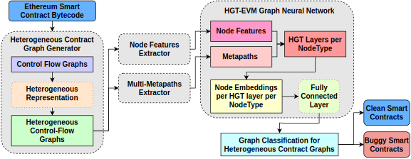

# [DEPRECATED] Smart Contract Vulnerabilities
[](https://www.python.org/)
[](https://github.com/crytic/slither)
[](https://www.dgl.ai/)

## ❗❗❗ This repository is deprecated and merged into our [MANDO-HGT](https://github.com/MANDO-Project/ge-sc-transformer) repository.


# Multi-Level Graph Embeddings

[](https://anonymous.4open.science/r/ge-sc-bytecode-67E5)

This repository is an implementation of HGT-EVM: Heterogeneous Graph Transformers for Vulnerability
Detection in Smart Contract Bytecode.
The source code is based on the implementation of [HGT](https://github.com/dmlc/dgl/tree/0.8.x/examples/pytorch/hgt) model using [Deep Graph Library](https://www.dgl.ai/).


The following figure shows the smart contract in several forms in our processing, let's have an intuitive view of the graph of source code as well.

[](https://anonymous.4open.science/r/ge-sc-bytecode-67E5)

# Table of contents

- [Smart Contract Vulnerabilities](#smart-contract-vulnerabilities)
- [Multi-Level Graph Embeddings](#multi-level-graph-embeddings)
- [Table of contents](#table-of-contents)
- [How to train the models?](#how-to-train-the-models)
  - [Dataset](#dataset)
  - [System Description](#system-description)
  - [Install Environment](#install-environment)
  - [Inspection scripts](#inspection-scripts)
  - [Trainer](#trainer)
    - [Usage](#usage)
    - [Examples](#examples)
  - [Testing](#testing)
  - [Visuallization](#visuallization)
  - [Results](#results)
    - [Apply HGT to HCFGs in creation bytecode.](#apply-hgt-to-hcfgs-in-creation-bytecode)
    - [Apply HGT to HCFGs in runtime bytecode.](#apply-hgt-to-hcfgs-in-runtime-bytecode)
- [Statistics](#statistics)
  - [Datasets](#datasets)
  - [Classification performance](#classification-performance)

# How to train the models?

## Dataset
- We prepared dataset for [experiments](experiments/ge-sc-data/byte_code).

## System Description

We run all experiments on 
- Ubuntu 20.04
- CUDA 11.1
- NVIDA RTX3080

## Install Environment
Install python required packages.
```bash
pip install -r requirements.txt -f https://download.pytorch.org/whl/lts/1.8/torch_lts.html -f https://data.pyg.org/whl/torch-1.8.0+cu111.html -f https://data.dgl.ai/wheels/repo.html
```

## Inspection scripts
We provied inspection scripts for Graph Classification tasks as well as their required data.

Training Phase
```bash
python -m experiments.graph_classification --epochs 50 --repeat 20 --model hgt --bytecode runtime
```

To show the result table
```bash
python -m experiments.graph_classification --result
```

## Trainer

### Usage

```bash
usage: HGT-EVM Graph Classifier [-h] [-s SEED] [-ld LOG_DIR] [--output_models OUTPUT_MODELS] [--compressed_graph COMPRESSED_GRAPH] [--dataset DATASET] [--testset TESTSET] [--label LABEL] [--checkpoint CHECKPOINT]
                                [--feature_extractor FEATURE_EXTRACTOR] [--node_feature NODE_FEATURE] [--k_folds K_FOLDS] [--test] [--non_visualize]

optional arguments:
  -h, --help            show this help message and exit
  -s SEED, --seed SEED  Random seed

Storage:
  Directories for util results

  -ld LOG_DIR, --log-dir LOG_DIR
                        Directory for saving training logs and visualization
  --output_models OUTPUT_MODELS
                        Where you want to save your models

Dataset:
  Dataset paths

  --compressed_graph COMPRESSED_GRAPH
                        Compressed graphs of dataset which was extracted by graph helper tools
  --dataset DATASET     Dicrectory of all souce code files which were used to extract the compressed graph
  --testset TESTSET     Dicrectory of all souce code files which is a partition of the dataset for testing
  --label LABEL         Label of sources in source code storage
  --checkpoint CHECKPOINT
                        Checkpoint of trained models

Node feature:
  Define the way to get node features

  --feature_extractor FEATURE_EXTRACTOR
                        If "node_feature" is "GAE" or "LINE" or "Node2vec", we need a extracted features from those models
  --node_feature NODE_FEATURE
                        Kind of node features we want to use, here is one of "nodetype", "metapath2vec", "gae", "line", "node2vec"

Optional configures:
  Advanced options

  --k_folds K_FOLDS     Config for cross validate strategy
  --test                Set true if you only want to run test phase
  --non_visualize       Wheather you want to visualize the metrics
```

### Examples
- We prepared some scripts for the custom HGT-EVM structures bellow:
- Graph Classication for Heterogeous Control Flow Graphs (HCFGs) which detect vulnerabilites at the contract level.
  - LINE as node features
```bash
python graph_classifier.py -ld ./logs/graph_classification/byte_code/line/access_control --output_models ./models/graph_classification/byte_code/line/access_control --dataset ./experiments/ge-sc-data/byte_code/smartbugs/runtime/gpickles/access_control/clean_57_buggy_curated_0/  --compressed_graph ./experiments/ge-sc-data/byte_code/smartbugs/runtime/gpickles/access_control/clean_57_buggy_curated_0/compressed_graphs/runtime_balanced_compressed_graphs.gpickle --label ./experiments/ge-sc-data/byte_code/smartbugs/contract_labels/access_control/creation_buggy_curated_contract_labels.json --node_feature line --feature_extractor ./experiments/ge-sc-data/byte_code/smartbugs/runtime/gpickles/gesc_matrices_node_embedding/balanced/matrix_line_dim128_of_core_graph_of_access_control_runtime_balanced_cfg_compressed_graphs.pkl --seed 1
```

## Testing
- We automatically run testing after training phase for now.

## Visuallization
- You also use tensorboard and take a look the trend of metrics for both training phase and testing phase.

```bash
tensorboard --logdir LOG_DIR
```

## Results

### Apply HGT to HCFGs in creation bytecode.
[](https://anonymous.4open.science/r/ge-sc-bytecode-67E5/)

### Apply HGT to HCFGs in runtime bytecode.
[](https://anonymous.4open.science/r/ge-sc-bytecode-67E5/)

# Statistics

We also make some statistics about the dataset and the last embedding we got from last layer of out models.

## Datasets

Our datasets were mixed from three resources: [SB Curated](https://github.com/smartbugs/smartbugs/tree/master/dataset), [SolidiFI Benchmark](https://github.com/smartbugs/SolidiFI-benchmark) and [SmartBugs Wild](https://github.com/smartbugs/smartbugs-wild) . The chart bellow indicate the proportion of smartcontract which have any bug or not.
- Creation dataset distribution

- Runtime dataset distribution


## Classification performance

We plot last embedding of each smart contract after applying the PCA to discover classification ability of our models.
In reentrancy bug, the following figure show embedding of the smart contracts in testset using serveral kind of input node features in creation and runtime bytecode.

- Creation bytecode last embedding.


- Runtime bytecode last embedding.

  
- Check [this link](https://anonymous.4open.science/r/ge-sc-bytecode-67E5/forensics) out to see more analysis.
